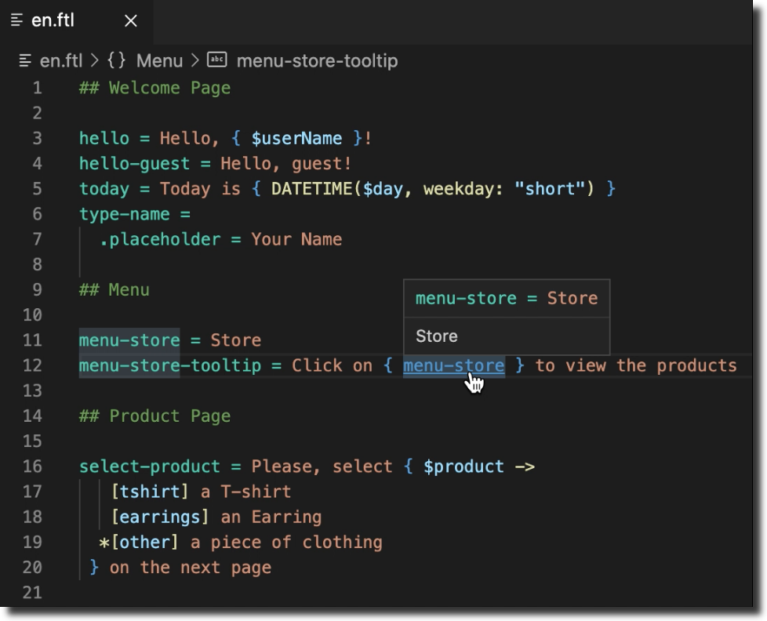
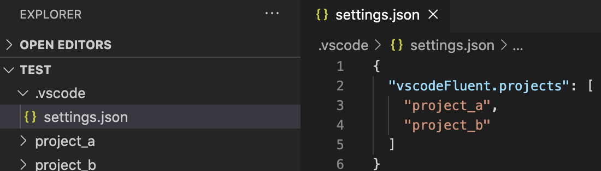

# vscode-fluent

> 💬 VS Code extension to work with Fluent, the correct-by-design l10n programming language

[](https://github.com/macabeus/vscode-fluent)
[](https://github.com/macabeus/vscode-fluent)
[](https://marketplace.visualstudio.com/items?itemName=macabeus.vscode-fluent)

<p align="center">
  
</p>

**Fluent** is a Mozilla's programming language for natural-sounding translations. And **vscode-fluent** is a VisualCode Studio extension to improve developer experience while working with this language.

- 🌎 [Official Fluent's website](https://projectfluent.org/)
- 📓 [Fluent Syntax Guide](https://www.projectfluent.org/fluent/guide/)
- 🎢 [Fluent's Playground](https://projectfluent.org/play/)
- 🎥 [Talk about localization and Fluent](https://youtu.be/nJnAVUIyf5U?t=76) (in Portuguese 🇧🇷)

## Feature

- Syntax highlight
- Show syntax errors
- Code Action to extract a string to Fluent files
- List file symbol (`⇧⌘O` on Mac, `Ctrl+Shift+O` on Linux and Windows)
- Hover support on messages
- Breadcrumbs support
- Go to message definition from a reference

## Code Action

### Extract string to FTL

<p align="center">
  
</p>

Using the code action "Extract to Fluent files" you can easly extract a string to from source code to all FTL files on your project.<br />
To open the code action menu, you should select a string (including its quotes) and then type `⌘ + .` (or `Ctrl + .`).

You can change the replacement template using the configuration `vscodeFluent.replacementTemplate`.

By default, the message will be added to all Fluent files on the workspace. But if you are working on a workspace with multiple projects, and each project has its Fluent files, you won't want mix messages between the projects. To avoid that, you should use the configuration `vscodeFluent.projects`, and add on it each projects's root path. See the bellow image for an instance.

<p align="center">
  
</p>

## How to develop vscode-fluent

### Syntax

The syntax is written on a [YML file](./syntaxes/fluent.tmLanguage.yml). Before to run the extension on VSCode, you should compile it to JSON.

```
> npm run build-syntaxes
```

### Extension

You can run the extension using the `Run Extension` task on VSCode.

### Tests

You can run the automated tests using the `Test Extension - No Workspace` and `Test Extension - With Workspace` tasks on VSCode.
